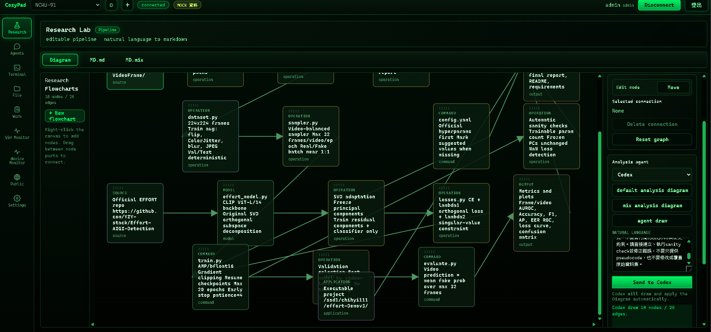
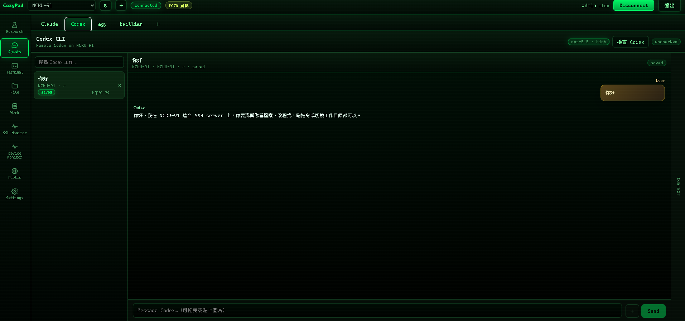
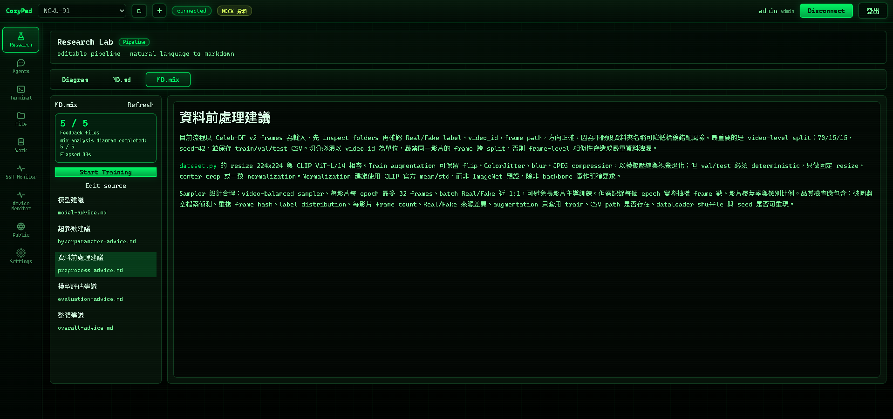

# CozyPad Web

CozyPad Web 是 CozyPad3 的公開文件與功能展示倉庫，重點整理目前的 SSH、Files、Agents、Research、Markdown、Monitor 與 Work 流程。

## 安裝教學

| 步驟 | 動作 | 說明 |
| --- | --- | --- |
| 1 | 下載 Release zip | 從 GitHub Releases 下載最新壓縮檔。 |
| 2 | 解壓縮專案 | 將 zip 解壓到本機工作目錄。 |
| 3 | 安裝 Node.js LTS | 建議使用 Node.js LTS，並啟用 corepack。 |
| 4 | 安裝套件 | 在專案根目錄執行 `corepack pnpm install`。 |
| 5 | 建立環境設定 | 依照範例檔建立 `.env`，填入本機需要的 SSH、Agent、Domain 與 API 設定。 |
| 6 | 啟動開發環境 | 一般前端使用 `corepack pnpm dev`；需要 legacy SSH API 時使用 `corepack pnpm dev:v2-web`。 |
| 7 | 檢查專案 | 建議執行 `corepack pnpm typecheck`，必要時再跑 `corepack pnpm lint` 與 `corepack pnpm build`。 |

## 功能總覽

| 功能 | 說明 |
| --- | --- |
| Agents | 整合 Codex、Claude、agy，支援遠端 SSH server 工作、任務紀錄、左右對話泡泡與 Markdown 顯示。 |
| Terminal | 可選擇已匯入的 SSH server，建立互動式終端連線；localhost 則使用本機終端模式。 |
| Files | 可連線到 SSH server 瀏覽檔案，支援文字、Markdown、PDF、圖片、音訊與影片預覽，也支援右鍵刪除、重新命名、新增資料夾。 |
| Research | 提供可拖曳流程圖畫布、節點連線、箭頭方向、框選移動、MD.md 與 MD.mix 分析結果。 |
| Work | 記錄 Codex / Claude / agy 產生的工作任務，訓練任務可從 Research 送出後追蹤。 |
| Markdown | 支援多個 `.md`、`.markdown`、`.txt` 檔案彙整，並以 Markdown 顯示回傳結果。 |
| Monitor | 參考 v1 伺服器資源監控，顯示 online server 的 CPU、RAM、DISK、GPU 與硬碟狀態。 |

## 最近更新日誌

| 日期 | 模組 | 更新內容 |
| --- | --- | --- |
| 2026-08-05 | Agents | agy 與 baillian 改成獨立視窗狀態，避免切換時共用同一個對話、輸入框或檢查結果。 |
| 2026-08-05 | Codex | Codex 新增「檢查 Codex」按鈕；未按 Connect 時不會發 SSH 請求，檢查結果以簡短狀態顯示。 |
| 2026-08-05 | SSH Monitor | 移除可見的 Codex sessions 區塊，只保留 Terminal channels、Monitor streams 與 Agent workers。 |
| 2026-08-04 | SSH 連線 | 移除 SSH gate 的 block 顯示；agent 只有在已有可用 Terminal 時才走 terminal bridge，否則改走後端連線流程。 |
| 2026-08-04 | SSH 連線 | 加入 ssh2 broker 與共用通道概念，降低短時間重複啟動 ssh.exe 的風險。 |
| 2026-08-04 | Monitor | Monitor 改為 30 秒更新一次，並共用同台 server 的監控連線，避免多頁籤造成連線數暴增。 |
| 2026-08-04 | Terminal | 不按 Connect 就不啟動 SSH；Terminal 以使用者主動開啟為準，避免背景自動連線。 |
| 2026-08-04 | Diagram | 優化流程圖操作，支援畫布捲動、框選移動、Delete 刪除選取項目與更大的工作區。 |
| 2026-08-04 | Research | 流程圖分析改成可選 agent；繪圖動作直接更新畫布，不再送到 agent 對話區。 |
| 2026-08-04 | baillian | 新增 baillian 分頁與 key 匯入流程，並支援切換百鍊模型設定。 |
| 2026-08-04 | Research Flowchart | 新增可拖曳流程圖節點、框選移動、上下左右連接點、綠色箭頭連線、節點刪除與右鍵新增節點。 |
| 2026-08-04 | Research MD.md | `default analysis diagram` 會將流程圖送往 91 進行分析，回傳內容寫入 `MD.md`，作為訓練排程主 prompt。 |
| 2026-08-04 | Research MD.mix | 新增 `mix analysis diagram`，會回傳五份 Markdown：模型建議、超參數建議、資料前處理建議、模型評估建議、整體建議。 |
| 2026-08-04 | Flowchart Batch API | `MD.mix` 分析改為 batch 呼叫 91 的 flowchart markdown API，一次處理 2 到 3 個項目，並依空閒 GPU 策略調整。 |
| 2026-08-04 | Flowchart Prompt | 每個 batch item 都會帶自己的檔名、圖片序號與專屬 instruction，要求只根據該圖片分析，不沿用同批其他圖片結論。 |
| 2026-08-04 | Flowchart Payload | batch payload 改用 `filename`、`image_base64`、`instruction`，並限制單張與整批大小，避免 base64 payload 過大。 |
| 2026-08-04 | Start Training | `Start Training` 改為非彈窗式輸入，可填入資料來源、模型來源與補充 prompt；送出後建立對應 Work 任務。 |
| 2026-08-04 | Work | `send training` 只建立一個 Work 任務，並改善刪除後舊紀錄殘留的問題。 |
| 2026-08-04 | Agents | Codex、Claude、agy 改為以遠端 server 服務為主，若對應 CLI 可在目標機器執行就顯示為可用。 |
| 2026-08-04 | Monitor | Monitor 改為單頁顯示一台機器，左側列 CPU/RAM/DISK/GPU，中間顯示 GPU，右側顯示硬碟；右側 drawer 只列 online server。 |
| 2026-08-04 | Domain / DDNS | DDNS agent 加入 CozyPad domain 更新流程與狀態頁，方便排查 tunnel、origin、public URL 與 1033 狀態。 |
| 2026-08-03 | Markdown | Markdown 頁新增多檔拖曳區，支援 `.md`、`.markdown`、`.txt`，回傳結果以 Markdown 排版顯示。 |
| 2026-08-03 | Files | Files 預覽擴充到圖片、PDF、Markdown、文字、MP3、MP4，並加入右鍵操作。 |
| 2026-08-03 | Research Table | Research 任務表改為 `run`、`status`、`duration`、`seed`、`start date`、`end date` 欄位。 |
| 2026-08-02 | 基礎整合 | 以 `CozyPad-0.2.9-alpha` 為基礎，逐步融合 v1 SSH 功能與 v2 Web 的 Agents / Terminal / Files / Monitor 介面精神。 |

## 測試資料

| 路徑 | 用途 |
| --- | --- |
| `docs/examples/markdown-summary/notes/` | 一般 Markdown 筆記彙整測試。 |
| `docs/examples/markdown-summary/messy-proof-notes/` | 混亂會議紀錄與重複 todo 的整理測試。 |
| `docs/examples/markdown-summary/fake-model-logs/` | 假模型訓練 log、ablation、scoreboard 與錯誤分析測試。 |

## 常用指令

| 動作 | 指令 |
| --- | --- |
| 安裝套件 | `corepack pnpm install` |
| 啟動 Web dev server | `corepack pnpm dev` |
| 啟動含 legacy API 的開發環境 | `corepack pnpm dev:v2-web` |
| 型別檢查 | `corepack pnpm typecheck` |
| Lint | `corepack pnpm lint` |
| Build | `corepack pnpm build` |

## Release 注意事項

Release zip 建議保留程式碼、文件、截圖與範例資料；部署或私人設定請在本機自行建立。

| 類型 | 說明 |
| --- | --- |
| `.env` / `.env.*` | 不應放入 release 或公開倉庫。 |
| SSH key / token | 不應放入 release 或公開倉庫。 |
| `data/` / `.run-logs/` | 依實際內容判斷，通常不應公開。 |
| `node_modules/` / `dist/` / build cache | 不需放入 release，可由使用者重新安裝或 build。 |

## 介面截圖

| 頁面 | 預覽 |
| --- | --- |
| Research Diagram |  |
| Codex Agent |  |
| Research MD.mix |  |
