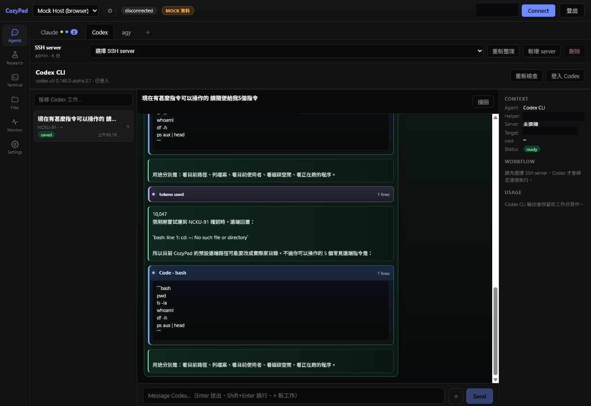
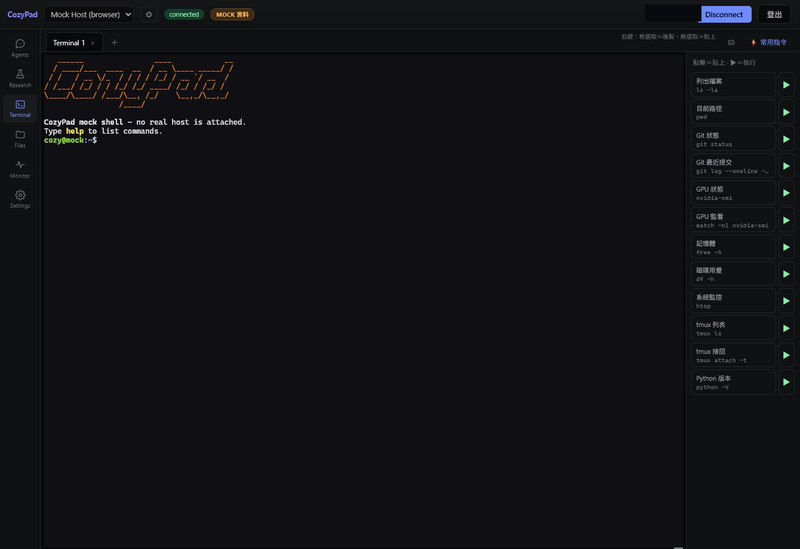
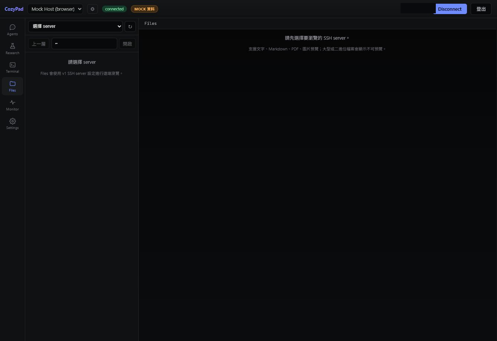
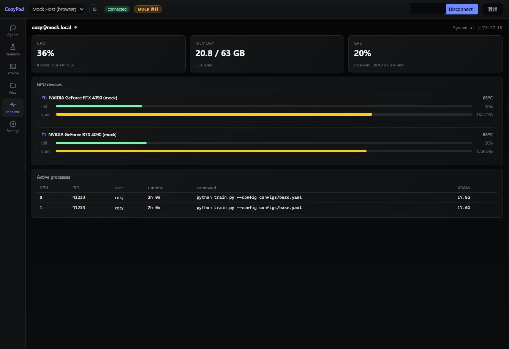

# CozyPad Web

CozyPad Web is a remote research workspace for SSH terminals, agent conversations,
file browsing, experiment diagrams, device monitoring, and public service checks.

CozyPad Web 是一套面向遠端研究與開發工作的管理介面，整合 SSH 終端、
Agent 對話、檔案瀏覽、實驗流程圖、裝置監控與公開服務狀態檢查。



| Area | Status |
| --- | --- |
| Remote agents | Codex / agy / baillian |
| Remote files | Folder browsing, file preview, path deep-link |
| Research workflow | Diagram, node feedback, MD.md, Start Training |
| Runtime target | SSH server first, localhost when selected |

---

# 中文說明

<p align="right">
  <a href="#english-guide"><kbd>English Guide →</kbd></a>
</p>

## 專案定位

CozyPad Web 主要用來把多台 SSH server、研究工作、Agent CLI 與檔案管理放在同一個網頁介面中。它適合需要在遠端 GPU server、Linux 工作站或本地開發機之間切換的使用者。

目前 Web 版本的重點是：

| 目標 | 說明 |
| --- | --- |
| 遠端工作不中斷 | Agent 工作、終端 session 與研究任務以 server/session 為核心保存狀態。 |
| 減少重複 SSH 連線 | 連線後盡量重用既有通道，避免因頻繁重連造成遠端安全機制阻擋。 |
| 研究流程視覺化 | 用可拖曳流程圖描述資料、模型、訓練、評估與輸出。 |
| Agent 輔助開發 | Codex、agy、baillian 以對話介面執行遠端任務，並保留可追蹤的執行泡泡。 |
| 安全預設 | 不公開私密設定、SSH key、token、log 與本機路徑。 |

## 介面預覽

| 功能 | 預覽 |
| --- | --- |
| Agents |  |
| Terminal |  |
| Files |  |
| Monitor |  |

## 目前能用的功能

| Workspace | 主要功能 | 補充 |
| --- | --- | --- |
| Research | 流程圖、節點回饋、Diagram 分析、MD.md、Start Training | 節點可拖曳、連線、框選移動、刪除；每個節點保存自己的說明與 Agent prompt。 |
| Agents | Codex、agy、baillian 遠端工作面板 | 支援對話泡泡、Markdown、程式碼高亮、公式渲染、圖片貼上/拖曳、路徑超連結、任務停止與訊息右鍵編輯。 |
| Terminal | 多分頁 SSH / local terminal | 進入 Terminal 會自動開啟終端；支援 quick commands、xterm、複製貼上與斷線重連控制。 |
| File | SSH 檔案瀏覽與預覽 | 支援資料夾深入瀏覽、上一層、複製路徑、圖片/PDF/Markdown/text/audio/video 預覽、agent 路徑跳轉、重新命名、刪除與新增資料夾。 |
| Work | 任務列表與狀態追蹤 | Agent 與 Start Training 產生的任務可回到對應工作畫面。 |
| device Monitor | SSH live monitor | 顯示在線 server 的 CPU、RAM、Disk、GPU、GPU process、溫度與磁碟狀態。 |
| Public | 公開服務狀態檢查 | 檢查 API、Web origin、Cloudflare Tunnel 與 public URL 狀態，並輔助判斷 403/1033/502/524。 |
| Settings | 連線與執行設定 | 管理 tmux、desktop/mobile 行為、remote runtime、host key 與開發測試設定。 |

## Research Lab

Research 是 CozyPad Web 的研究流程工作區。

| 功能 | 說明 |
| --- | --- |
| Flowchart tabs | 每個流程圖是一個獨立工作單位，可新增、重新命名、刪除與切換。 |
| Diagram canvas | 方塊可拖移、框選移動，節點四邊都有連接點，連線以綠色箭頭顯示方向。 |
| Node templates | 內建 Input、Output、Dataset、Model、Train、Evaluate、Application。 |
| Node detail | 點選 node 可開啟視窗，以 Markdown 顯示該節點用途與 Agent prompt。 |
| Node feedback | 對每個節點產生更廣泛的研究建議，並可送入 Diagram 分析。 |
| Agent Draw | 以自然語言要求 Agent 重新產生或修改流程圖。 |
| MD.md | 作為訓練排程與訓練 prompt 的主要彙整文件。 |
| Start Training | 從 Diagram/MD.md 建立訓練任務，支援 model weight path、conda env 與資料/模型來源描述。 |

## Agents

Agents 介面目前以遠端 server 為主，不以本機 CLI 取代遠端工作。切換 server 後，Agent 任務會綁定到選取的遠端目標。

| Agent | 用途 | 狀態 |
| --- | --- | --- |
| Codex | 遠端 Codex CLI 工作、程式修改、研究任務輔助 | 可用 |
| agy | 遠端 agy CLI 工作 | 可用 |
| baillian | 百鍊相關 Agent 工作，可匯入 runtime key | 可用 |

Agent 對話顯示包含：

| 類型 | 顯示方式 |
| --- | --- |
| 使用者訊息 | 右側泡泡，可右鍵編輯已送出的 prompt。 |
| Agent 文字回覆 | 左側 Markdown 內容，支援清楚段落與公式。 |
| 指令、工具、狀態訊息 | 可折疊的處理泡泡，避免長命令塞滿畫面。 |
| 程式碼 | 高亮程式碼區塊。 |
| 公式 | KaTeX/LaTeX 顯示。 |
| 圖片 | 支援拖曳、貼上、附件預覽，以及 agent 產生圖片路徑的對話框預覽。 |
| 遠端路徑 | 一般文字、Markdown link、inline code 與工具輸出中的 `/home/...`、`/ssd...` 等路徑可直接跳到 File。 |

### Agent 路徑與圖片預覽

Agent 回覆如果包含遠端路徑，CozyPad 會在顯示層自動轉成可點擊路徑，不需要 agent 額外輸出特殊格式。

| 回覆內容 | 行為 |
| --- | --- |
| `/ssd8/project/output.png` | 在對話框顯示圖片預覽，點擊可切到 File。 |
| `` `/ssd8/project/train.py` `` | inline code 若完整是遠端路徑，會轉為 File 連結。 |
| `/home/user/project` | 直接切到 File 並開啟該資料夾。 |
| `/home/user/result.png` | 先開啟父資料夾，再選取並預覽該檔案。 |

## Terminal

Terminal 使用 xterm 介面並支援多工作分頁。

| 功能 | 說明 |
| --- | --- |
| SSH terminal | 對已選 server 開啟互動式終端。 |
| Local terminal | 選 localhost 時不走 SSH，使用本機終端模式。 |
| Quick commands | 內建 `ls -la`、`pwd`、`git status`、`nvidia-smi`、`df -h`、`tmux ls` 等常用指令。 |
| Mobile friendly | 支援快捷鍵列與長按重複輸入，方便手機操作。 |
| Reconnect policy | 連線中斷時可手動重連，避免背景自動狂重試造成 SSH 風險。 |

## Files

Files workspace 是遠端檔案管理與預覽介面。

| 功能 | 說明 |
| --- | --- |
| Directory browser | 左右面板同步瀏覽資料夾，可逐層進入更深路徑。 |
| Path actions | 可複製目前路徑、上一層、重新整理與直接開啟指定路徑。 |
| Context menu | 右鍵檔案/資料夾可重新命名或刪除；空白處右鍵可新增資料夾。 |
| Preview | 支援圖片、PDF、Markdown、文字、音訊與影片預覽。 |
| Editor | 支援多種文字與程式碼檔案的 Monaco editor。 |
| Safe navigation | 瀏覽器上一頁快捷鍵只回到檔案上一層，不會直接刷掉整個頁面。 |
| Agent deep-link | 從 Agent 對話點選檔案路徑時，會自動切到父資料夾並預覽目標檔案。 |

## device Monitor

device Monitor 會從已連線的 SSH server 讀取即時資源狀態。

| 區塊 | 顯示內容 |
| --- | --- |
| 左側 | 機器名稱、CPU、RAM、Disk、GPU 總覽。 |
| 中間 | GPU 使用率、VRAM、溫度、功耗與 process 摘要。 |
| 右側 drawer | 只列出 online server；離線 server 不會顯示在可選清單中。 |
| 控制 | Pause、Refresh、real time、interval 與 selected monitor 狀態。 |

## Public Status

Public workspace 用於確認公開服務的健康狀態。

| 檢查項 | 說明 |
| --- | --- |
| API | CozyPad API 是否回應。 |
| Web origin | Web dev/server origin 是否正常。 |
| Tunnel | Cloudflare Tunnel connector 是否存在並運作。 |
| Public URL | 入口是否被 Cloudflare 安全層、WAF 或 tunnel 狀態影響。 |

## 安裝與啟動

### Web 開發模式

```powershell
pnpm install
pnpm dev
```

### Legacy API / SSH 功能

```powershell
pnpm legacy-v2:api
```

### Desktop 開發模式

```powershell
pnpm dev:desktop
```

### Windows installer

Desktop app 使用 Electron Builder 與 NSIS。

```powershell
pnpm --filter @cozypad/desktop package
```

## 專案結構

| 路徑 | 說明 |
| --- | --- |
| `apps/app` | React + Vite Web 介面。 |
| `apps/desktop` | Electron desktop wrapper 與 Windows installer 設定。 |
| `apps/mobile` | Capacitor Android mobile shell。 |
| `packages/contracts` | 共用型別與 contract。 |
| `packages/remote-services` | 遠端服務抽象與 SSH/agent 相關服務。 |
| `packages/tmux-runtime` | tmux runtime 相關邏輯。 |
| `scripts/legacy-v2-api-server.mjs` | Legacy API、SSH、Agent、Monitor、Public status 的後端入口。 |
| `docs/screenshots` | README 與 Release 使用的公開截圖。 |

## 安全設計

| 項目 | 原則 |
| --- | --- |
| 私密資料 | 不提交 `.env`、token、SSH key、runtime key、log、data 或本機私有設定。 |
| SSH | 不在失敗後自動狂重試；遠端通道盡量重用既有 session。 |
| 刪除/改名 | 檔案刪除、改名與資料夾建立透過 UI 操作確認。 |
| Cloudflare | 可搭配 Tunnel、WAF、Access 或非機器人驗證作為入口保護。 |
| Agent key | baillian runtime key 以使用者匯入為主，不應寫入公開 repository。 |

## 近期更新

| 日期 | 更新 |
| --- | --- |
| 2026-08-13 | Agent 回覆中的遠端路徑全面支援 File 超連結，涵蓋 Markdown、inline code、一般文字與工具/status 泡泡。 |
| 2026-08-13 | 對話框新增 agent 產生圖片路徑預覽；點選圖片路徑會切到 File 並預覽該檔案。 |
| 2026-08-13 | Files 修正從 agent 深層連結開啟檔案時誤當資料夾瀏覽造成 502 的問題，現在會開父資料夾並預覽檔案。 |
| 2026-08-13 | Files 列表載入逾時與大型目錄處理調整，降低長目錄造成 UI 卡住或請求中止的風險。 |
| 2026-08-12 | README 重新整理為中英雙語，依目前 Web 功能重新盤點。 |
| 2026-08-12 | 強化 Agent 訊息顯示：Markdown、程式碼、公式、處理泡泡與可編輯送出訊息。 |
| 2026-08-12 | 調整 Files 導覽與路徑操作，支援多媒體預覽與檔案右鍵功能。 |
| 2026-08-12 | Research 導入可互動 Diagram、節點回饋、Agent Draw 與 Start Training 流程。 |
| 2026-08-12 | device Monitor 改為單機視圖與 online server drawer。 |

## Contributors

| Contributor | Role |
| --- | --- |
| IlikeBB | Maintainer |
| youchengchao | Collaborator |
| yifanwang | Collaborator |

---

# English Guide

<p align="right">
  <a href="#中文說明"><kbd>← 繁體中文</kbd></a>
</p>

## Overview

CozyPad Web is a browser-based workspace for remote development and research. It combines SSH terminals, agent-driven work, remote file browsing, experiment diagrams, device monitoring, and public service diagnostics in one interface.

It is designed for users who frequently move between remote GPU servers, Linux machines, and local development environments.

## Feature Map

| Workspace | Features | Notes |
| --- | --- | --- |
| Research | Flowcharts, node feedback, Diagram analysis, MD.md, Start Training | Nodes are draggable and connectable. Each node keeps its own documentation and agent prompt. |
| Agents | Remote Codex, agy, and baillian panels | Supports Markdown, code highlighting, LaTeX formulas, image attachments, path deep-links, task stop, and edit-on-right-click for sent prompts. |
| Terminal | Multi-tab SSH/local terminal | Uses xterm, quick commands, copy/paste, mobile key bar, and controlled reconnect behavior. |
| File | Remote file browser and previewer | Supports folders, path copy, image/PDF/Markdown/text/audio/video preview, agent path deep-linking, rename, delete, and folder creation. |
| Work | Task tracking | Agent and training jobs can link back to their related workspace. |
| device Monitor | SSH live resource monitor | Shows CPU, RAM, disk, GPU, GPU process, temperature, and online server drawer. |
| Public | Public service health checks | Helps diagnose API, origin, tunnel, Cloudflare security, and timeout states. |
| Settings | Runtime and connection settings | Controls tmux, desktop/mobile behavior, remote runtime, host key, and dev options. |

## Research Lab

Research Lab turns experiment planning into an editable diagram.

| Capability | Description |
| --- | --- |
| Flowchart tabs | Create, rename, delete, and switch independent flowcharts. |
| Diagram canvas | Move nodes, box-select multiple nodes, connect ports, and delete selected edges. |
| Node templates | Input, Output, Dataset, Model, Train, Evaluate, and Application. |
| Node detail | Click a node to open a Markdown-based detail dialog. |
| Node feedback | Generate broader research feedback for every node and feed it into Diagram analysis. |
| Agent Draw | Ask an agent to create or revise the current Diagram from natural language. |
| MD.md | Main training-plan Markdown generated from the Diagram. |
| Start Training | Creates an agent-backed training job from the Diagram and MD.md content. |

## Agents

Agents run against the selected remote server. CozyPad does not replace remote work with a local CLI unless the target is explicitly localhost.

| Agent | Purpose | Availability |
| --- | --- | --- |
| Codex | Remote Codex CLI work, code changes, and research assistance | Available |
| agy | Remote agy CLI work | Available |
| baillian | Bailian-related agent work with user-supplied runtime key | Available |

The chat interface supports:

| Content | Rendering |
| --- | --- |
| User messages | Right-side bubbles with right-click edit. |
| Agent text replies | Left-side Markdown rendering. |
| Tool/status output | Collapsible process bubbles. |
| Code | Syntax-highlighted code blocks. |
| Math | KaTeX/LaTeX formulas. |
| Images | Drag-and-drop, paste attachments, and previews for agent-generated image paths. |
| Remote paths | `/home/...`, `/ssd...`, and similar paths in text, Markdown links, inline code, and tool output can open the File workspace directly. |

### Agent Path And Image Preview

When an agent reply contains a remote path, CozyPad turns it into an interactive File link at render time. Agents do not need to emit custom UI markup.

| Reply content | Behavior |
| --- | --- |
| `/ssd8/project/output.png` | Shows an image preview in the chat and can open the File workspace. |
| `` `/ssd8/project/train.py` `` | Inline code that is exactly a remote path becomes a File link. |
| `/home/user/project` | Opens the folder in File. |
| `/home/user/result.png` | Opens the parent folder, selects the file, and previews it. |

## Terminal

The Terminal workspace uses xterm and supports both remote SSH and local terminal sessions.

| Feature | Description |
| --- | --- |
| SSH terminal | Opens an interactive terminal on the selected server. |
| Local terminal | Uses local terminal mode when localhost is selected. |
| Quick commands | Includes common commands such as `ls -la`, `pwd`, `git status`, `nvidia-smi`, `df -h`, and `tmux ls`. |
| Mobile support | Provides a key bar and press-and-hold input behavior. |
| Reconnect control | Avoids aggressive automatic SSH retry loops. |

## Files

The Files workspace is a remote file browser and preview surface.

| Feature | Description |
| --- | --- |
| Directory browser | Navigate into folders while keeping left and right panes synchronized. |
| Path actions | Copy current path, go up one level, refresh, and open a typed path. |
| Context menu | Rename/delete items and create folders from empty-space context menu. |
| Preview | Images, PDFs, Markdown, text, audio, and video. |
| Editor | Monaco-based text/code editing for supported files. |
| Back navigation | Browser back shortcuts move up one folder instead of resetting the page. |
| Agent deep-link | Clicking a file path from an agent message opens the parent folder and previews the target file. |

## device Monitor

device Monitor reads live resource data from connected SSH servers.

| Area | Content |
| --- | --- |
| Left | Host name, CPU, RAM, disk, and GPU overview. |
| Center | GPU utilization, VRAM, temperature, power, and process summary. |
| Right drawer | Online servers only. Offline servers are hidden from the selectable drawer. |
| Controls | Pause, Refresh, real time mode, interval, and selected monitor state. |

## Public Status

Public Status helps identify whether an outage is caused by the API, web origin, tunnel, Cloudflare security, or a timeout.

| Check | Description |
| --- | --- |
| API | CozyPad API health. |
| Web origin | Web origin response. |
| Tunnel | Cloudflare Tunnel connector state. |
| Public URL | Edge/security response and public entry status. |

## Getting Started

### Web development

```powershell
pnpm install
pnpm dev
```

### Legacy API / SSH features

```powershell
pnpm legacy-v2:api
```

### Desktop development

```powershell
pnpm dev:desktop
```

### Windows installer

The desktop app uses Electron Builder with NSIS.

```powershell
pnpm --filter @cozypad/desktop package
```

## Repository Layout

| Path | Description |
| --- | --- |
| `apps/app` | React + Vite web application. |
| `apps/desktop` | Electron wrapper and Windows installer configuration. |
| `apps/mobile` | Capacitor Android shell. |
| `packages/contracts` | Shared contracts and types. |
| `packages/remote-services` | Remote service and SSH/agent abstractions. |
| `packages/tmux-runtime` | tmux runtime utilities. |
| `scripts/legacy-v2-api-server.mjs` | Legacy API, SSH, agent, monitor, and public status backend entry. |
| `docs/screenshots` | Public screenshots for README and releases. |

## Security Notes

| Area | Policy |
| --- | --- |
| Private data | Do not commit `.env`, tokens, SSH keys, runtime keys, logs, data, or local private configs. |
| SSH | Avoid automatic repeated retries after failures; prefer reusing established sessions. |
| File actions | Destructive actions are performed through explicit UI commands. |
| Cloudflare | Can be paired with Tunnel, WAF, Access, or bot checks for public entry protection. |
| Agent keys | Runtime keys are user-supplied and must not be committed to the public repository. |

## Recent Updates

| Date | Update |
| --- | --- |
| 2026-08-13 | Remote paths in agent replies now open File links across Markdown, inline code, plain text, and tool/status bubbles. |
| 2026-08-13 | Chat now previews agent-generated image paths and can jump from the preview to the File workspace. |
| 2026-08-13 | Fixed File deep-link behavior for file paths from agents: files now open through their parent folder and preview pane instead of being browsed as folders. |
| 2026-08-13 | Improved Files listing timeout and large-directory handling to reduce aborted requests and frozen UI states. |
| 2026-08-12 | Rebuilt README as a bilingual document based on the current Web feature set. |
| 2026-08-12 | Improved Agent message rendering with Markdown, code, math, process bubbles, and sent-message editing. |
| 2026-08-12 | Improved Files navigation, path actions, media preview, and context menu operations. |
| 2026-08-12 | Added interactive Research Diagrams, node feedback, Agent Draw, and Start Training workflow. |
| 2026-08-12 | Updated device Monitor around single-machine views and online-server drawer. |

## Contributors

| Contributor | Role |
| --- | --- |
| IlikeBB | Maintainer |
| youchengchao | Collaborator |
| yifanwang | Collaborator |
