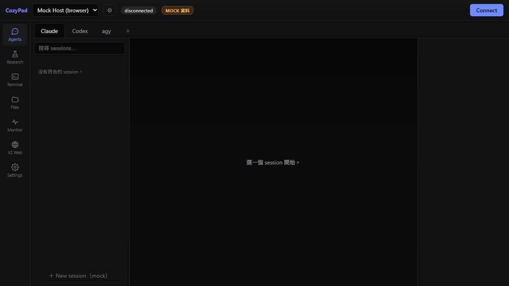
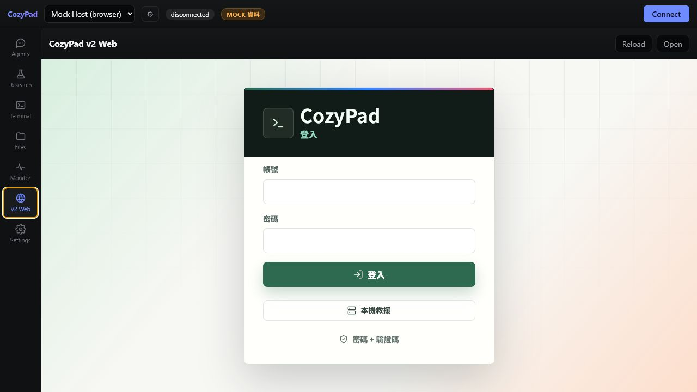

# CozyPad Web

**CozyPad Web** 是一個用來管理遠端 SSH 工作環境的網頁工作台。  
目前版本以 **CozyPad-0.2.9-alpha** 的初始架構為主，並把既有 **v2 網頁版頁面** 以獨立工作區方式整合進來，方便保留新版架構的穩定性，同時逐步移植 v2 功能。

> 本 README 以中文整理目前專案狀態、功能表、執行方式與介面截圖。截圖為本機開發畫面，不包含真實帳密或私有伺服器資訊。

## 專案狀態

| 項目 | 目前狀態 | 說明 |
| --- | --- | --- |
| 主架構 | CozyPad-0.2.9-alpha | 保留 alpha 版的 workspace / sidebar / bridge 架構 |
| v2 Web 頁面 | 已整合 | 以 `V2 Web` 工作區掛載，降低 CSS/JS 互相影響 |
| Legacy API | 已接入 | 透過 `/api` proxy 轉到本機 legacy API server |
| 截圖文件 | 已整理 | README 內含目前 alpha 主頁與 v2 web 登入頁截圖 |
| 驗證狀態 | 通過 | lint、typecheck、test、build 均已通過 |

## 網頁截圖

| 畫面 | 截圖 |
| --- | --- |
| CozyPad alpha 主介面 |  |
| V2 Web 工作區 |  |

## 功能總覽

| 功能模組 | 目標用途 | 目前狀態 |
| --- | --- | --- |
| Agents | 管理 Claude / Codex / agy 等遠端 agent session | 架構保留，持續整合 |
| Terminal | 連線遠端 SSH、保留終端工作狀態 | alpha 架構已具備 |
| Files | 遠端檔案瀏覽、文字檔與文件預覽 | alpha 架構已具備 |
| Monitor | CPU、RAM、GPU、磁碟等系統監控 | alpha 架構已具備 |
| V2 Web | 掛載既有 CozyPad v2 網頁登入與 SSH 管理頁面 | 已接入 |
| Settings | 主機、tmux、bridge 與平台設定 | alpha 架構已具備 |

## 架構整理

| 層級 | 技術 / 目錄 | 說明 |
| --- | --- | --- |
| Web UI | React + TypeScript | 共用的 CozyPad 使用者介面 |
| Desktop Shell | Electron | 桌面端平台能力、SSH、檔案與安全儲存 |
| Mobile Shell | Capacitor | Android / 行動端封裝方向 |
| Shared Contracts | Zod + TypeScript | 前後端 bridge / IPC 的資料格式約束 |
| Legacy v2 Web | `public/legacy-v2` | 以 iframe 方式掛入 alpha 主介面 |
| Legacy API | `scripts/legacy-v2-api-server.mjs` | 提供 v2 web 既有 `/api` 功能 |

## 快速啟動

| 目的 | 指令 |
| --- | --- |
| 安裝依賴 | `corepack pnpm install` |
| 啟動 alpha web | `corepack pnpm dev` |
| 啟動 alpha + v2 web API | `corepack pnpm dev:v2-web` |
| 型別檢查 | `corepack pnpm typecheck` |
| 測試 | `corepack pnpm test` |
| 打包 | `corepack pnpm build` |

啟動後預設頁面：

| 服務 | URL | 用途 |
| --- | --- | --- |
| CozyPad Web | `http://localhost:5173/` | 主要開發頁面 |
| Legacy API | `http://127.0.0.1:5174/` | v2 web API proxy 目標 |

## 安全設計重點

| 類別 | 設計方向 |
| --- | --- |
| 登入防護 | 建議使用 Cloudflare Access 作為外層保護，再搭配 CozyPad 自身帳密與 TOTP 2FA |
| SSH 憑證 | 新增 server 時使用密碼安裝 key，之後以 key 連線，避免長期保存明文密碼 |
| SSH 重試 | 失敗後不自動高頻率重試，避免被遠端主機誤判為攻擊 |
| 高風險操作 | 檔案刪除、move、domain 更新等操作應加入二次確認 |
| 隔離整合 | v2 web 以 iframe 掛入，避免舊版 CSS/JS 污染 alpha 主介面 |

## 目前整合策略

| 決策 | 原因 |
| --- | --- |
| 以 CozyPad-0.2.9-alpha 為主 | alpha 架構較適合長期維護，workspace 與 platform bridge 邊界清楚 |
| v2 web 先以 iframe 掛載 | 可快速保留既有 UI 與登入流程，同時避免大規模重寫造成不穩 |
| legacy API 獨立啟動 | 讓 v2 頁面可沿用既有 API，後續再逐步遷移到正式 bridge |
| README 使用截圖 | 方便快速理解目前頁面狀態與整合結果 |

## 建議後續工作

| 優先順序 | 工作 | 說明 |
| --- | --- | --- |
| 高 | 將 v2 SSH 功能逐步轉成 alpha workspace 原生元件 | 減少 iframe 與 legacy API 依賴 |
| 高 | 補完整登入 / TOTP / session 文件 | 讓部署安全流程更明確 |
| 中 | 補 domain 管理文件 | 包含 Cloudflare DDNS、Record 選單、更新確認流程 |
| 中 | 補遠端 Codex 工作流文件 | 明確定義任務保存、server 綁定與 session resume |
| 低 | 補更多響應式截圖 | 包含手機、平板與桌面不同尺寸 |

## 注意事項

| 項目 | 說明 |
| --- | --- |
| 帳密與金鑰 | 不應提交 `.env`、SSH key、Cloudflare token 或任何私密設定到 GitHub |
| 本機開發 | 若 `5173` 或 `5174` 被其他 CozyPad 版本佔用，需先關閉舊服務 |
| GitHub README | GitHub 會優先顯示 `README.md`，`readme.txt` 保留作為純文字備份 |

